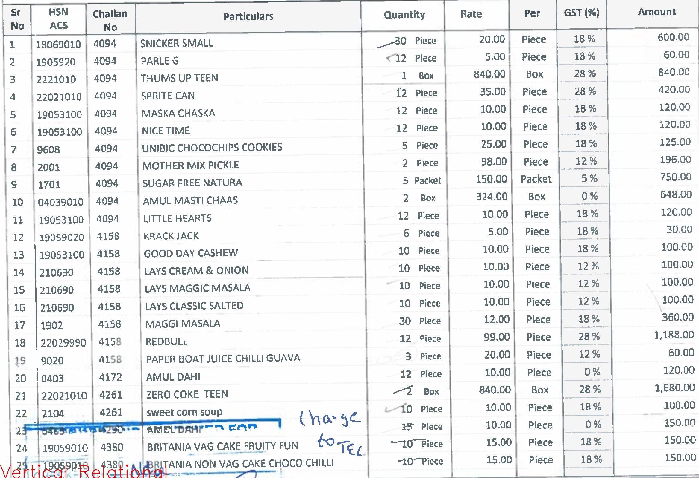
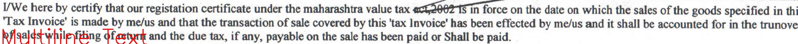
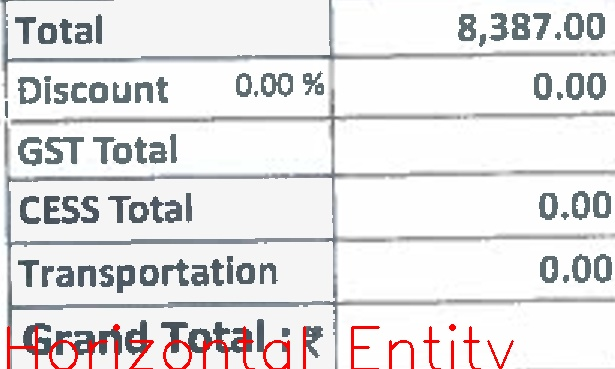
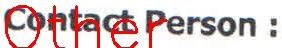

# Bounding-box-Classifier

A Deep Learning API to classifiy type of detected bounding boxes.

## Data
Data can include structured documents such as invoices, reports and bank statements. Labeling of the data needs to be done using an image
annotation tool such as [LabelImg](https://github.com/tzutalin/labelImg). This API can also be used at the end of table detection model
such as Faster RCNN in a bounding-box detection and classification pipeline, which is where the inspiration for this API came from. <br><br>
The data output by LabelImg should be in `YOLO` format, on which the `denormalize` method of the class can operate. If `xml` is chosen as the
output format, a separate function will need to be written to parse the files and extract bounding box coordinates. 

## Usage
All parameters for training/testing can be configured in `config.ini` file. 
```python
# NOTE: comment out the `training` or `load pretrained` as per requirement. 


########################## get config
config = Config()
config.create_config('config.ini')

cc = ContainerClassifier()


######################### training 

cc.read_train_data(path=config.train_data_folder_path, 
	           resize_to=config.resize_to, 
	           class_dict=config.class_dict, 
	           use_labels=config.use_labels)

cc.train(model=config.architecture, 
         epochs=config.epochs, 
         batch_size=config.batch_size, 
         optimizer=config.optimizer, 
         summary=config.print_model_summary)

cc.save_model(name=config.model_name, 
	      path=config.save_to_dir)


######################### load pretrained
cc.load_model(json_path=config.load_from_dir+'.json', 
	      weights_path=config.load_from_dir+'.h5')


######################### testing
cc.read_test_data(path=config.test_data_folder_path, 
	          resize_to=config.resize_to, 
	          class_dict=config.class_dict, 
	          use_labels=config.use_labels)

cc.test_model(output_dir=config.test_output_dir, 
	      top_k=config.top_k, 
	      plot_outputs=config.plot_outputs)


```
## Output


### Training Description
- Training data: 1020 <br>
- Arch: resnet101 <br>
- Image Size: 224x224 <br>
- Pretrained: False <br>
- Epochs: 30 <br><br>


### Testing Metrics 


```python
Classification Report:

			    	      precision    recall  f1-score   support

	vertical relational	   0       0.83      0.89      0.86        54
	horizontal entity	   1       0.97      0.82      0.89        39
	multiline text		   2       0.98      0.92      0.95       105
	other tabular		   3       0.68      0.62      0.65        24
	other		  	   4       0.61      0.91      0.73        33
	logo		  	   5       0.67      0.40      0.50        15

			    accuracy                           0.84       270
			   macro avg       0.79      0.76      0.76       270
			weighted avg       0.86      0.84      0.84       270

 

Confusion Matrix:

[[48  1  0  4  1  0]    0: vertical relational
 [ 4 32  0  3  0  0]    1: horizontal entity
 [ 0  0 97  0  8  0]    2: multiline text
 [ 6  0  2 15  1  0]    3: other tabular
 [ 0  0  0  0 30  3]    4: other
 [ 0  0  0  0  9  6]]   5: logo

```
 
 ### Sample Output Images
 1. Vertical Relational Table: <br><br>
  <br><br>
 
 2. Multiline Text: <br><br>
  <br><br>
 
 3. Horizontal Entity Table: <br><br>
  <br><br>
 
 4. Other:<br><br>
  <br><br>
 
 
 ## References
 The Taxonomy to classify table types was inspired by the following paper:<br>
 - Kyosuke Nishida, Kugatsu Sadamitsu, Ryuichiro Higashinaka, Yoshihiro Matsuo - Understanding the Semantic Structures of Tables with a
Hybrid Deep Neural Network Architecture - *Proceedings of the Thirty-First AAAI Conference on Artificial Intelligence (AAAI-17)* [arXiv](https://arxiv.org/pdf/1901.04672)
 
 ## License
 The contents of this repo are covered under the [MIT License]('./LICENSE').
